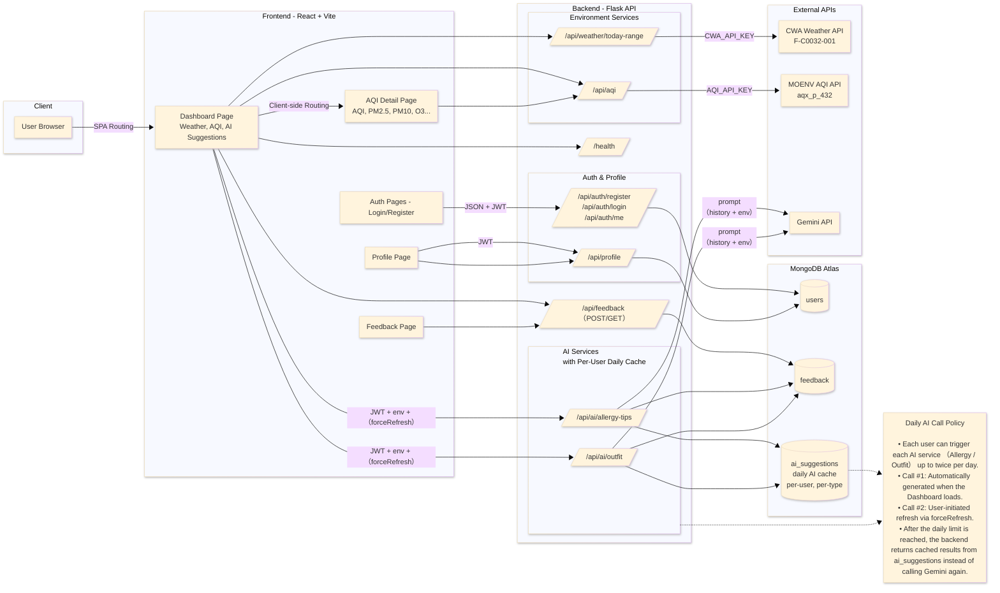
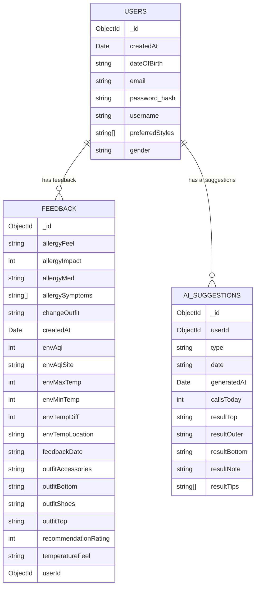

# BreezyDay
## Project Overview

**BreezyDay** is an AI-powered weather and allergy assistant that integrates CWA weather data, MOENV AQI, and user feedback into one dashboard.
It predicts daily allergy risk and provides personalized outfit + prevention suggestions using Gemini.

This project focuses on solving three practical issues faced by allergy-sensitive users:

### 1. Scattered environmental data

Weather, AQI, and other air-pollution indicators are scattered across different sources.
BreezyDay **consolidates key environmental data into a single, real-time dashboard**.

### 2. No intuitive allergy insight

Typical apps show AQI numbers, but users still don't know:
“Will I feel uncomfortable today?”
BreezyDay **converts AQI into Low / Moderate / High allergy-risk levels**.

### 3. No actionable guidance

Users still struggle deciding:
“What should I wear?”  
“Should I bring a mask?”

The system uses Gemini together with **user feedback history and real-time environmental data** to **generate personalized outfit and allergy-prevention suggestions**.

## Features Overview 
- **Integrated Environment Dashboard**
Real-time weather, AQI, temperature range , and weather phenomenon in one place. 

- **Allergy Risk Assessment** 
Converts AQI indicator into an intuitive Low / Moderate / High risk level

- **AI Personalized Suggestions** 
Gemini-powered outfit recommendations and allergy-prevention advice, based on user feedback and live environment data. 

- **Secure Authentication** 
JWT-based login, registration, and protected endpoints.

- **User Feedback Loop** 
Stores user feeling/response logs in MongoDB Atlas to refine future AI recommendations. 

- **External API Integration**
Fully automated data retrieval from CWA Weather API and MOENV AQI API.

## Tech Stack Overview 
### Frontend
- React + Vite (TypeScript)
- Axios / Fetch for API requests
- JWT-based authentication handling

### Backend
- Flask (Python) RESTful API
- Flask-JWT-Extended for authentication
- Flask-Bcrypt for password hashing
- CORS and backend proxy for secure API key usage

### External Data Sources
- CWA Open Data API (F-C0032-001): temperature, weather, weather phenomenon
- MOENV AQI API: AQI / PM2.5 data 
(Both API proxied through backend)

### AI Integration
- Google Gemini API (gemini-2.5-flash-lite)
- Custom prompts combining today's environment and recent user feedback

### Database
- MongoDB Atlas (NoSQL)
- Collections: `users`, `feedback`

### Infrastructure
- Environment variables via `.env`


## System Architecture 

## ERD

## File Structure

```
BREEZYDAY/
│
├── backend/
│   ├── .venv/                  # Python 虛擬環境
│   ├── .env                    # Flask backend 環境變數
│   ├── app.py                  # Flask 主入口
│   └── ai_gemini.py
│
├── frontend/
│   ├── node_modules/
│   ├── public/
│   ├── src/
│   │   ├── assets/             # 靜態圖片、icons
│   │   │
│   │   ├── context/
│   │   │   └── AuthContext.tsx # JWT 登入狀態管理
│   │   │
│   │   ├── features/         
│   │   │   └── aqi/            # AQI 模組
│   │   │       ├── aqi.css
│   │   │       ├── AQIDashboard.tsx
│   │   │       ├── AQIPage.tsx
│   │   │       ├── AQITable.tsx
│   │   │       ├── aqiTypes.ts
│   │   │       ├── aqiUtils.ts
│   │   │       ├── PollutantCards.tsx
│   │   │       └── PollutantChart.tsx
│   │   │
│   │   ├── pages/
│   │   │   ├── AuthPage.tsx
│   │   │   ├── Dashboard.tsx
│   │   │   ├── Landing.tsx
│   │   │   └── ProfilePage.tsx
│   │   │
│   │   ├── services/
│   │   │   └── authApi.ts      # Login / Register API
│   │   │
│   │   ├── styles/
│   │   │   ├── Dashboard.css
│   │   │   ├── global.css      # 全域樣式
│   │   │   └── ProfilePage.css
│   │   │
│   │   ├── App.css
│   │   ├── App.tsx             # React 主組件
│   │   └── main.tsx            
│   │
│   ├── .env.local              # Vite 前端環境變數
│   ├── index.html
│   ├── package.json
│   ├── vite.config.ts
│   └── tsconfig.json
│
└── README.md

```


## High-Level API Endpoints (Simplified) 

### Auth
| Method | Endpoint | Description |
|--------|----------|-------------|
| POST | `/api/auth/register` | Create a new account |
| POST | `/api/auth/login` | Login and receive JWT token |
| GET  | `/api/auth/me` | Get authenticated user information |

### Profile
| Method | Endpoint | Description |
|--------|----------|-------------|
| GET  | `/api/profile` | Retrieve user profile |
| PUT  | `/api/profile` | Update profile fields |

### Weather (CWA)
| Method | Endpoint | Description |
|--------|----------|-------------|
| GET | `/api/weather/today-range` | Today’s max/min temperature, temp diff, weather description (API key protected) |

### Air Quality (MOENV)
| Method | Endpoint | Description |
|--------|----------|-------------|
| GET | `/api/aqi` | Real-time AQI/PM2.5 data (backend-proxied, API key protected) |

### Feedback
| Method | Endpoint | Description |
|--------|----------|-------------|
| POST | `/api/feedback` | Submit daily feedback with environment data |
| GET  | `/api/feedback` | Get all feedback for current user |

### AI (Gemini)
| Method | Endpoint | Description |
|--------|----------|-------------|
| POST | `/api/ai/allergy-tips` | Generate 5 allergy-prevention suggestions |
| POST | `/api/ai/outfit` | Generate personalized outfit recommendations |

### Health
| Method | Endpoint | Description |
|--------|----------|-------------|
| GET | `/health` | Backend health check |


## Getting Started 

### 1. Prerequisites

- Node.js 18+
- npm (or yarn)
- Python 3.10+
- MongoDB Atlas account (MONGO_URI set in `.env`)


### 2. Clone the repository
```bash
git clone https://github.com/PhoebeLu1011/BreezyDay.git
cd breezyday
```
### 3. Setup Frontend (React + Vite)
```bash
cd frontend
npm install
npm run dev
```
### 4. Setup Backend (Flask)
```bash
cd backend
pip install -r requirements.txt
python app.py
```
### 5. Environment Variables
Create a `.env` file under backend/:
```bash
# ===== Database =====
# MongoDB Atlas connection
MONGO_URI=your_mongodb_atlas_connection_string

# ===== Authentication =====
JWT_SECRET_KEY=your_jwt_secret_key

# ===== External APIs =====
# MOENV Air Quality API
AQI_API_KEY=your_moenv_aqi_api_key     # Required

# Central Weather Administration (CWA) forecast API (F-C0032-001)
CWA_API_KEY=your_cwa_api_key           # Required
```

## Important Code
### 1. CWA Weather API (F-C0032-001)
```python
@app.get("/api/weather/today-range")
def get_today_temp_range():
    params = {
        "Authorization": app.config["CWA_API_KEY"],
        "format": "JSON",
        "locationName": request.args.get("locationName", "臺北市"),
    }

    resp = requests.get(
        "https://opendata.cwa.gov.tw/api/v1/rest/datastore/F-C0032-001",
        params=params,
        timeout=10,
    )

    data = resp.json()
    location = data["records"]["location"][0]

    # Extract MaxT, MinT, PoP12h, Wx...
    return jsonify({
        "success": True,
        "locationName": location["locationName"],
        "maxTemp": max_temp,
        "minTemp": min_temp,
        "tempDiff": temp_diff,
        "weatherDesc": wx_str,
    })
```

This endpoint retrieves today’s MaxT, MinT, temperature difference, and weather description directly from Taiwan CWA’s F-C0032-001 dataset.


### 2. MOENV AQI API (aqx_p_432)
```python
@app.get("/api/aqi")
def get_aqi():
    api_key = os.getenv("AQI_API_KEY")
    base_url = os.getenv("AQI_API_URL", "https://data.moenv.gov.tw/api/v2/aqx_p_432")

    url = f"{base_url}?api_key={api_key}&format=json"

    resp = requests.get(url, timeout=8)
    resp.raise_for_status()

    return jsonify(resp.json())
```

This backend proxy fetches AQI, PM2.5, and related air-quality data.
Using a proxy ensures the API key is never exposed on the frontend.

### 3. Gemini API
### 3-1. Building Gemini Prompt Using Feedback History + Today’s Environment
```python
def build_allergy_prompt(feedbacks: List[Dict], today_env: Dict) -> str:
    prompt = f"""
    You are an allergy assistant for a weather and outfit recommendation dashboard.

    User history:
    {history_block}

    Today environment:
    {chr(10).join(env_lines) if env_lines else "No environment info."}

    Task:
    Based on the history and today's environment, give EXACTLY FIVE short
    bullet-point suggestions...
    """
    return textwrap.dedent(prompt).strip()
```

This function combines:

- today’s AQI and temperature

- the user’s latest 10 feedback log

  to generate a well-structured prompt for Gemini.


### 3-2. Calling Gemini for Personalized Outfit Suggestions


## Credits
- Central Weather Administration (CWA) Open Data — F-C0032-001 Forecast API  
- Ministry of Environment (MOENV) — AQI & Air Quality Data  
- Google Gemini API — Personalized outfit & allergy-prevention suggestions  
- MongoDB Atlas — Cloud database service  
- React / Vite / TypeScript  
- Flask (Python) — Backend and external API integration

