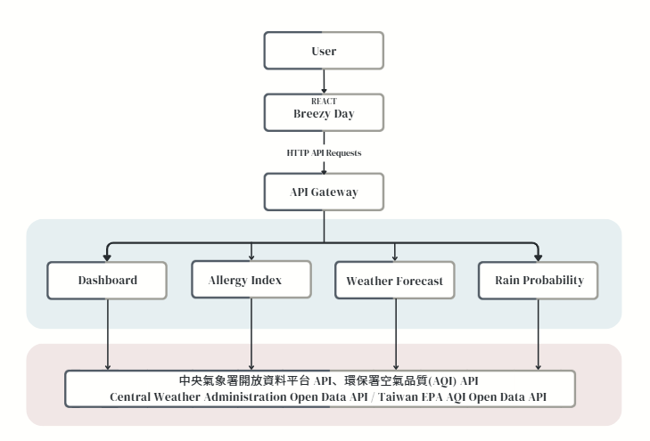

## Breezy Day

"Breezy Day" is a website designed for people who frequently experience allergies.

## | How to run
### Prerequisites
- Node.js 18+  
- npm (or yarn)
- MongoDB Atlas account (URI already configured in `.env`)

---
### Frontend(React+Vite)
```cmd
# 進入前端資料夾
cd breezy_day

# 安裝依賴
npm install

# 啟動開發伺服器
npm run dev
```
前端預設在 http://localhost:5173

### Backend
```
# 進入後端資料夾
cd breezy_day/server

# 安裝依賴
npm install

# 建立環境變數檔 .env


```
`.env`:

```env
MONGO_URI=mongodb+srv://breezyday_user:<password>@cluster0.xxxxxx.mongodb.net/breezyday
JWT_SECRET=change_this_secret
PORT=5000
```

啟動:

```cmd
# 啟動後端伺服器 (自動偵測修改)
npm run dev
```

後端預設在 http://localhost:5000

### |　Motivation

As someone who often suffers from allergies, this website aims to provide daily weather and air quality insights to help users prepare suitable outfits and minimize allergic reactions.

### |　System Architecture Overview



The system includes four modules:  Dashboard, Allergy Index, Weather Forecast, and Rain Probability.

Each module retrieves specific data through the API Gateway, which connects to the Central Weather Administration and Taiwan EPA AQI Open Data APIs.

The Dashboard then integrates all the information to provide users with a comprehensive overview of weather and allergy conditions.


### | 第一次提案記錄
1. 加入gemini ai model(prompt json匯入)) 那感覺生成穿搭建議那邊就會使用到gemini會比較好
2. 部署Render(再說)
3. database(我自己比較喜歡用mongodb)
database要幹嘛:
- 登入登出系統
- 儲存使用者回報資料
    - 雖然今天可能24度 系統不覺得冷 但使用者覺得很冷要穿薄外套(過敏反應也適用)
    - 使用者偏好的穿衣風格與形式(匹如說他就是喜歡穿短袖但會加很多外套在外面)
所以目前的想像
1. 會多一個介面about 使用者回報 (同時也可以進行我們想做的大數據分析)
介面目前的想法
(1) 問題
- 輸入今天的穿搭是?
- 那覺得今天的穿衣? 很冷/ 剛好/ 很熱\
- 你覺得有甚麼特別需要調整的地方
- 今日過敏反應: 嚴重/ 普通 / 無
- 今天的建議跟實際適用的打分(?/10)
- 其他想說的
...
2. 在主選單會有一個update profile/setting
裡面可以放使用者反饋(setting) profile就是因應登入系統做的個人資料頁面
- profile想像下面可能可以有視覺畫圖表記錄溫度跟使用者感受的部分(看時間決定 還沒想好)
